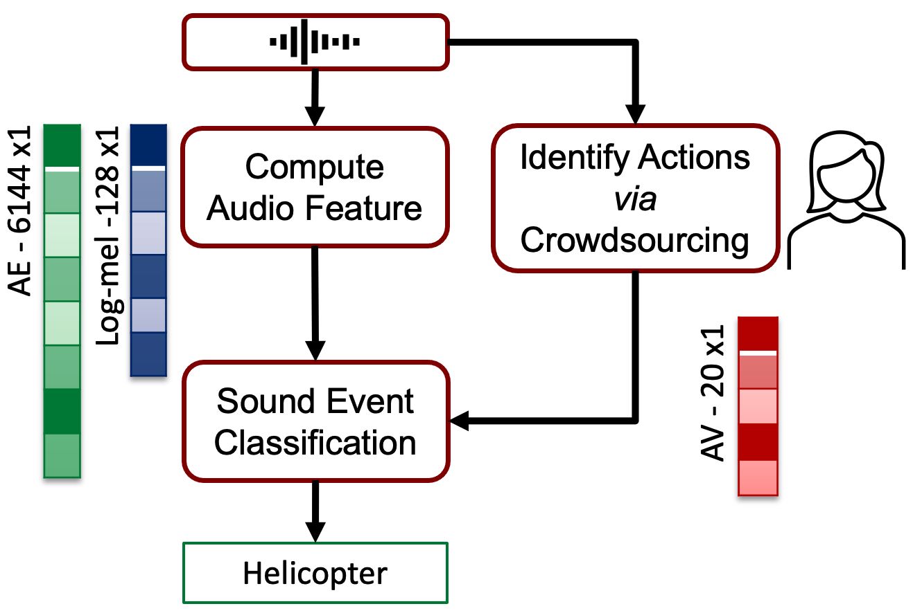

## Identifying Actions for Sound Event Classification

###### [Overview](#Identifying-Actions-for-Sound-Event-Classification) | [Abstract](#abstract) | [ESC-50 dataset](#ESC-50-dataset) | [Acknowledgements](#Acknowledgements)

## Abstract

In Psychology, actions are pivotal for humans to perceive and separate sound events. In Machine Learning, action recognition achieves high accuracy; however, it has not been asked if identifying actions can benefit Sound Event Classification (SEC), as opposed to semi-direct processing of the audio signal. Therefore, we propose a new Psychology-inspired approach for SEC that includes identification of actions via human listeners. Because audio features and AVs capture different abstractions of the acoustic content, we combined them and achieved one of the highest reported accuracy (86.75%) in ESC-50 (human performance is 81%), showing that Psychology-inspired approaches can improve SEC.

Typically, SEC takes the input audio, computes audio features and assigns a class label. We proposed to add an intermediate step where listeners identify actions in the audio. The identified actions are transformed into Action Vectors and are used for automatic SEC.

## Actions for ESC-50 dataset

In order to relate actions to sound events, we chose a well-studied sound event dataset called ESC-50. We selected 20 actions that in isolation or combination could have produced at least part (of most) of the 50 sound events. 

| | | | | |
| :--- | :--- | :--- | :--- | :--- |
|dripping |rolling |groaning |crumpling |wailing|
|splashing |scraping |gasping | blowing |calling |
|pouring   |exhaling |singing |exploding |ringing |
|breaking |vibrating |tapping |rotating |sizzling |

The [**ESC-50 dataset**](https://github.com/karolpiczak/ESC-50) is a sound event labeled collection of 2000 audio recordings suitable for benchmarking methods of environmental sound classification. The dataset consists of 5-second-long recordings organized into 50 semantical classes (with 40 examples per class) loosely arranged into 5 major categories:

| Animals | Natural soundscapes & water sounds  | Human, non-speech sounds | Interior/domestic sounds | Exterior/urban noises |
| :--- | :--- | :--- | :--- | :--- |
| Dog | Rain | Crying baby | Door knock | Helicopter |
| Rooster | Sea waves | Sneezing | Mouse click | Chainsaw |
| Pig | Crackling fire | Clapping | Keyboard typing | Siren |
| Cow | Crickets | Breathing | Door, wood creaks | Car horn |
| Frog | Chirping birds | Coughing | Can opening | Engine |
| Cat | Water drops | Footsteps | Washing machine | Train |
| Hen | Wind | Laughing | Vacuum cleaner | Church bells |
| Insects (flying) | Pouring water | Brushing teeth | Clock alarm | Airplane |
| Sheep | Toilet flush | Snoring | Clock tick | Fireworks |
| Crow | Thunderstorm | Drinking, sipping | Glass breaking | Hand saw |

## Citing

Link to [arxiv paper](https://github.com/bmartin1/Identifying_Actions_for_Sound_Event_Classification/edit/main/README.md).

If you find this research or dataset useful please cite:

    @inproceedings{XX,
      title = {Identifying Actions for Sound Event Classification},
      author = {Elizalde, Benjamin, add other authors XX},
      date = {XX},
      url = {XX},
      publisher = {XX}
    }
    
Link to related work [Never-Ending Learning of Sounds - PhD thesis](https://kilthub.cmu.edu/ndownloader/files/25813502)

    @phdthesis{elizalde2020never,
      title={Never-Ending Learning of Sounds},
      author={Elizalde, Benjamin},
      year={2020},
      school={Carnegie Mellon University}
    }
    
## Acknowledgements

Thanks to the different funding sources, Bosch Research Pittsburgh and Sense Of Wonder Group.
